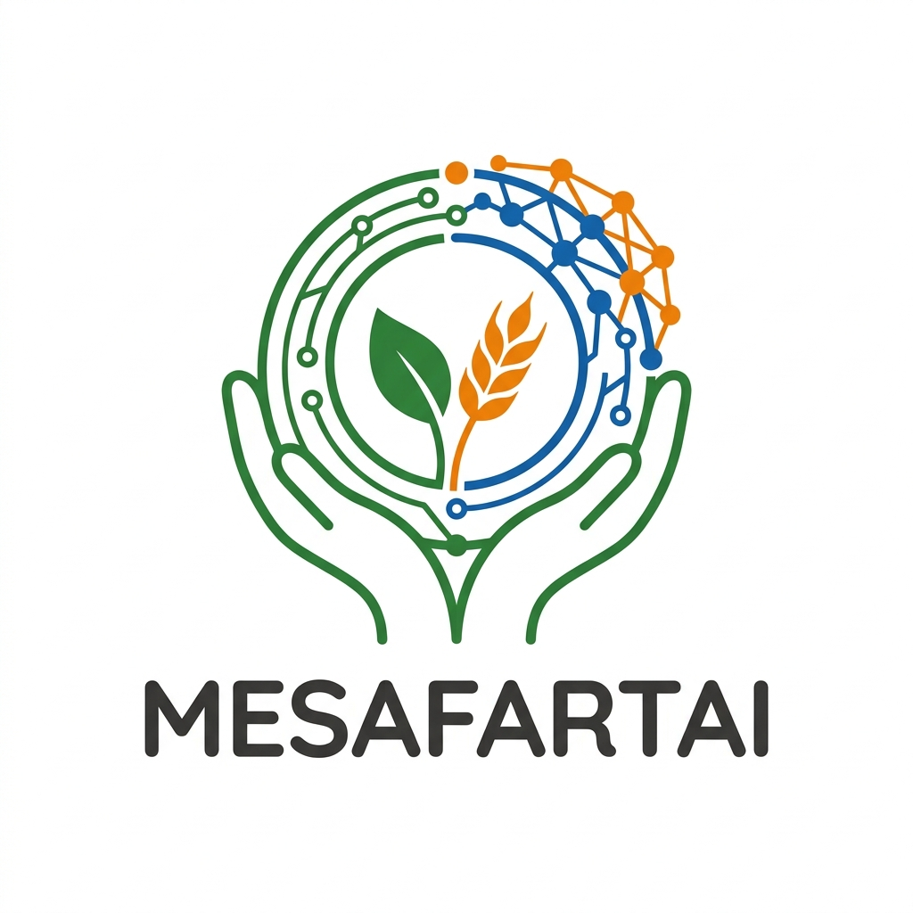
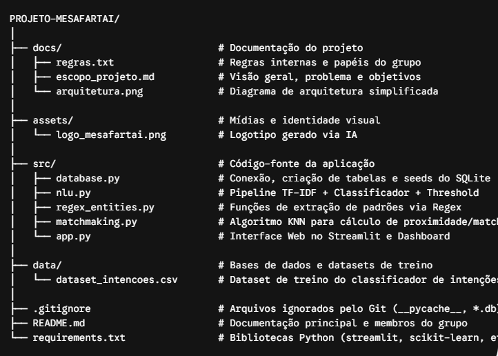
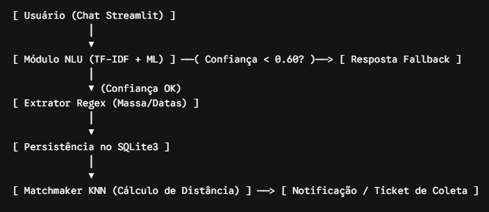

<p align="center">
  
</p>

# MESAFARTAI - Logística e Inteligência Assistiva no Combate à Fome

Projeto da disciplina de **Machine Learning & Chatbots** (turma de terça), desenvolvido pelo grupo **NPC**.

## A ideia

Muita comida boa vai pro lixo todo dia. Supermercado, restaurante, padaria e feirante acabam descartando alimento que ainda dá pra comer, porque está perto de vencer, porque a fruta ficou feia ou porque sobrou. Enquanto isso, ONGs e abrigos da região passam aperto pra conseguir doação.

O problema quase nunca é falta de comida. É que doar dá trabalho. O dono do restaurante não vai parar o expediente pra preencher formulário por causa de 15 marmitas que sobraram, e a ONG do bairro nem fica sabendo que aquilo existia.

A nossa proposta é um chatbot onde o doador manda uma mensagem do jeito que ele falaria normalmente, tipo:

> "Tenho uns 30kg de verdura que vence amanhã, alguém consegue buscar até as 18h?"

E o sistema faz o resto:

- entende o que a pessoa quer (doar, pedir alimento, consultar uma coleta ou algo fora do assunto) usando um classificador de intenções com TF-IDF + Scikit-Learn;
- se não tiver certeza do que entendeu (confiança abaixo de 0.60), ele não chuta: pede pra pessoa explicar de novo;
- puxa da frase o alimento, a quantidade e a validade usando Regex;
- salva tudo num banco SQLite;
- usa KNN pra achar a ONG mais perto do doador e gerar a coleta.

A interface vai ser feita em Streamlit, com um modo "Sou Doador" e outro "Sou ONG".

## Por que isso importa (ODS 2)

O projeto conversa direto com a **ODS 2 da ONU – Fome Zero e Agricultura Sustentável**, principalmente com a meta 2.1, que fala em garantir que pessoas em situação de vulnerabilidade tenham acesso a alimento seguro e suficiente o ano todo. De quebra, também ajuda na meta 12.3 (ODS 12), que é reduzir o desperdício de comida.

A gente gostou da ideia justamente por ser um problema real e próximo: dá pra imaginar o mercado da esquina e o abrigo do bairro usando isso.

## Integrantes

| Nome | RA | Curso |
|---|---|---|
| Pedro Vitor da Silva Oliveira | 130785 | Ciência da Computação |
| Nicollas Hardt Urnau | 117763 | Ciência da Computação |
| Caio Gabriel Souza dos Santos | 118316 | Ciência da Computação |

## Como o repositório está organizado

```
PROJETO-MESAFARTAI/
├── docs/
│   ├── regras.txt                  # o que foi pedido na etapa 1, regras e papéis do grupo
│   ├── escopo_projeto.md           # problema, público, intenções, dados e prompt do logo
│   ├── arquitetura_mesafartai.png
│   └── diag_fluxo_mesafartai.png
├── assets/
│   └── logo_mesafartai.png         # logo gerado com IA
├── src/
│   └── database.py                 # cria o banco SQLite e insere os dados de teste
├── data/                           # aqui vai entrar o dataset de intenções
├── .gitignore
├── README.md
└── requirements.txt
```

Os outros arquivos do `src/` (`nlu.py`, `regex_entities.py`, `matchmaking.py` e `app.py`) vão sendo criados nas próximas aulas.

A arquitetura e o fluxo de dados que estamos seguindo:

| Arquitetura | Fluxo de dados |
|---|---|
|  |  |

## Rodando o projeto

Por enquanto a única parte executável é o banco de dados.

```bash
git clone https://github.com/Th3L0ck1/PROJETO-MESAFARTAI.git
cd PROJETO-MESAFARTAI
pip install -r requirements.txt
python src/database.py
```

Se der tudo certo, aparece algo assim:

```
✅ Dados iniciais de teste inseridos com sucesso!
✅ Banco de dados 'mesafartai.db' inicializado com sucesso!
   - usuarios: 4 registro(s)
   - doacoes: 2 registro(s)
   - matches: 0 registro(s)
```

O banco já vem com 2 ONGs, 2 doadores e 2 doações de teste. Pode rodar o script mais de uma vez que ele não duplica os dados.

## Andamento

- [x] **06/10** – Kickoff, documentação, arquitetura, banco SQLite e carga inicial
- [ ] **13/10** – Classificador de intenções + trava de confiança (fallback)
- [ ] **27/10** – Extração com Regex + matchmaking com KNN (entrega da AC-3)
- [ ] **03/11** – Chat no Streamlit ligado ao back-end
- [ ] **10/11** – Dashboard de impacto + testes
- [ ] **17/11** – Demo Day (entrega da AC-4)
