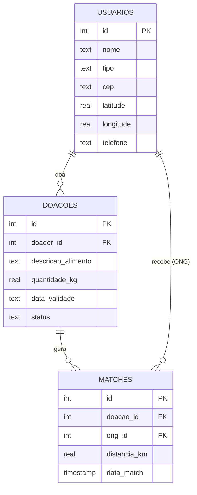

# 📄 Escopo do Projeto – MESAFARTAI

**MESAFARTAI - Logística e Inteligência Assistiva no Combate à Fome**
Disciplina: Machine Learning & Chatbots · Turma: Terça-feira

---

## 1. Problema de Negócio

Diariamente, toneladas de alimentos ainda próprios para consumo são descartadas por supermercados, restaurantes, padarias, feirantes e produtores rurais. Os principais motivos são:

- proximidade da data de validade;
- pequenos defeitos estéticos (frutas "feias", embalagens amassadas);
- excesso de estoque ou sobra de produção (marmitas, pães do dia).

Ao mesmo tempo, ONGs, abrigos e cozinhas comunitárias sofrem com a falta de suprimentos para alimentar famílias em situação de vulnerabilidade.

**O gargalo não é a falta de comida, e sim a falta de logística ágil e de comunicação eficiente.** Um comerciante não tem tempo de preencher formulários extensos para doar 30 kg de alimentos que vencem em 24 horas, e a ONG muitas vezes nem sabe que aquela doação existe.

### Proposta de solução

Um **chatbot com Inteligência Assistiva** em que o doador escreve uma mensagem informal, como:

> *"Tenho 30kg de frutas e verduras que vencem amanhã, alguém busca até as 18h?"*

e o sistema automaticamente:

1. **Entende a intenção** da mensagem (NLU: TF-IDF + classificador Scikit-Learn);
2. **Bloqueia frases ambíguas** com uma trava de confiança (*threshold* < 0.60 → mensagem de *fallback* amigável pedindo para reformular);
3. **Extrai as entidades** (alimento, quantidade, validade, horário) via **Regex**;
4. **Salva a doação no SQLite3**;
5. **Encontra a ONG mais próxima** com o algoritmo **KNN** (distância entre coordenadas geográficas) e gera um ticket de coleta.

### Alinhamento com a ODS 2

O projeto atende à **ODS 2 – Fome Zero e Agricultura Sustentável** (Meta 2.1: garantir acesso a alimentos seguros e nutritivos para pessoas em situação de vulnerabilidade) e, indiretamente, à **Meta 12.3** (reduzir o desperdício de alimentos).

---

## 2. Público-Alvo

O sistema possui **dois perfis**, alternados na barra lateral da interface Streamlit (`[Sou Doador | Sou ONG]`):

| | 🧑‍🌾 **Doadores** | 🏠 **ONGs / Receptores** |
|---|---|---|
| **Quem são** | Supermercados, restaurantes, padarias, feirantes, produtores rurais e pessoas físicas | ONGs, abrigos, cozinhas comunitárias, bancos de alimentos |
| **Dor principal** | Pouco tempo; alimento perto do vencimento; custo de descarte | Escassez e imprevisibilidade de doações |
| **O que querem fazer no chat** | Cadastrar uma doação de forma rápida e informal | Solicitar alimentos e acompanhar coletas |
| **Valor entregue** | Doar em uma mensagem, sem formulário; redução de desperdício | Receber alertas de doações próximas, com menor custo logístico |

---

## 3. Escopo das Intenções (NLU)

O classificador de intenções tratará **4 classes**:

| Intenção | Perfil | Descrição | Exemplos de frases |
|---|---|---|---|
| `cadastrar_doacao` | Doador | O usuário quer oferecer alimentos | "Tenho 20kg de arroz pra doar"; "Sobraram 15 marmitas hoje, alguém quer?"; "Quero doar 3 caixas de leite que vencem amanhã" |
| `solicitar_alimentos` | ONG | A ONG precisa receber alimentos | "Estamos precisando de cestas básicas"; "Nosso abrigo está sem feijão"; "Tem alguma doação de verduras perto de nós?" |
| `consultar_status` | Ambos | Acompanhar uma doação/coleta | "Minha doação já foi retirada?"; "Qual o status da coleta?"; "Alguma ONG aceitou meu pedido?" |
| `fora_de_escopo` | Ambos | Mensagens que não pertencem ao domínio | "Qual o placar do jogo?"; "Me conta uma piada"; "Quanto está o dólar?" |

### Trava de segurança (Threshold / Fallback)

- Se a maior probabilidade retornada pelo classificador (`predict_proba`) for **menor que 0.60**, o bot **não executa nenhuma ação** e responde com um *fallback* amigável:
  > *"Desculpe, não entendi muito bem 😅. Você quer **doar** alimentos, **solicitar** alimentos ou **consultar o status** de uma coleta?"*
- Mensagens classificadas como `fora_de_escopo` recebem uma resposta educada explicando o propósito do MESAFARTAI.

---

## 4. Dados Coletados no Chat

### 4.1 Entidades extraídas via Regex (a partir da mensagem livre)

| Entidade | Exemplos reconhecidos | Coluna no banco |
|---|---|---|
| **Quantidade + unidade** | `30kg`, `30 quilos`, `5 caixas`, `12 unidades`, `20 marmitas` | `doacoes.quantidade_kg` |
| **Tipo de alimento** | arroz, feijão, frutas, verduras, pães, leite, marmitas, carnes | `doacoes.descricao_alimento` |
| **Validade / prazo** | `hoje`, `amanhã`, `até sexta`, `10/10`, `18h`, `até as 18:00` | `doacoes.data_validade` |

### 4.2 Dados cadastrais do usuário

| Dado | Uso | Coluna no banco |
|---|---|---|
| Nome / Razão social | Identificação | `usuarios.nome` |
| Perfil (DOADOR ou ONG) | Regras do chat | `usuarios.tipo` |
| CEP | Localização | `usuarios.cep` |
| Latitude / Longitude | Cálculo de distância no KNN | `usuarios.latitude`, `usuarios.longitude` |
| Telefone | Contato para a coleta | `usuarios.telefone` |

### 4.3 Dados gerados pelo sistema

| Dado | Origem | Tabela |
|---|---|---|
| Status da doação (`DISPONIVEL`, `RESERVADA`, `COLETADA`) | Fluxo do chat | `doacoes.status` |
| ONG escolhida e distância (km) | Algoritmo KNN | `matches.ong_id`, `matches.distancia_km` |
| Data/hora do match | Automático | `matches.data_match` |

### Modelo de dados (SQLite3)



---

## 5. Fora do Escopo (nesta versão)

- Pagamentos ou qualquer transação financeira;
- Roteirização de veículos com múltiplas paradas;
- Integração com WhatsApp/Telegram (o chat será via Streamlit);
- Controle sanitário/fiscal dos alimentos doados.

---

## 6. Identidade Visual – Logotipo gerado via IA

<p align="center">
  
</p>

- **Ferramenta utilizada:** Gerador de imagens por IA (Google Gemini – modelo de geração de imagens)
- **Conceito:** mãos acolhedoras (acolhimento/solidariedade) segurando um prato com folha e trigo (alimento), cujo contorno se transforma em circuitos e nós de rede neural (tecnologia/IA assistiva), lembrando pontos de um mapa (logística/matchmaking).
- **Arquivo:** `assets/logo_mesafartai.png`

### Prompt exato utilizado

```text
Logotipo minimalista e moderno para "MESAFARTAI", uma plataforma de inteligência artificial assistiva que conecta doadores de alimentos a ONGs no combate à fome. O símbolo central une duas mãos acolhedoras em formato de concha segurando um prato com uma folha verde e um grão de trigo, onde o contorno do prato se transforma em circuitos digitais e nós de rede neural que se conectam como pontos de um mapa. Paleta de cores: verde-esperança (#2E7D32), laranja quente (#F57C00) e azul tecnologia (#1565C0) sobre fundo branco. Estilo flat design vetorial, linhas limpas, ícone centralizado com o texto "MESAFARTAI" em fonte sans-serif arredondada e em negrito logo abaixo. Transmite acolhimento, solidariedade e tecnologia.
```
